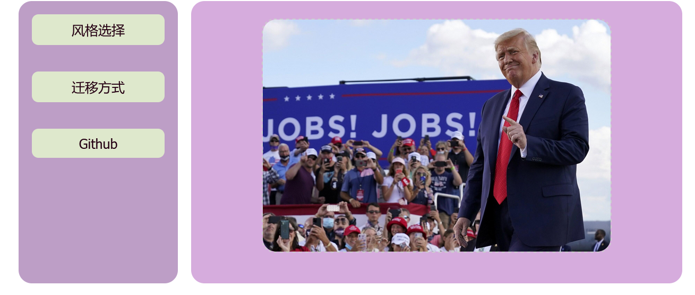
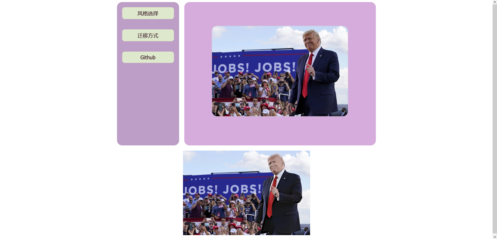
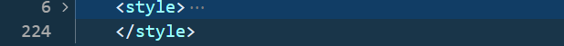
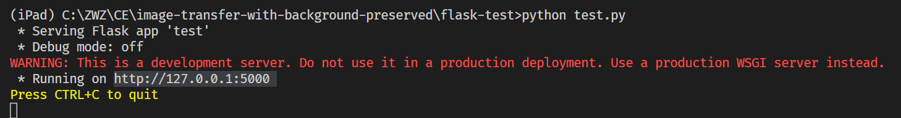
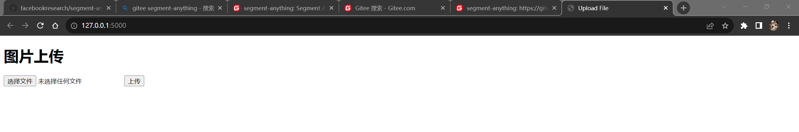
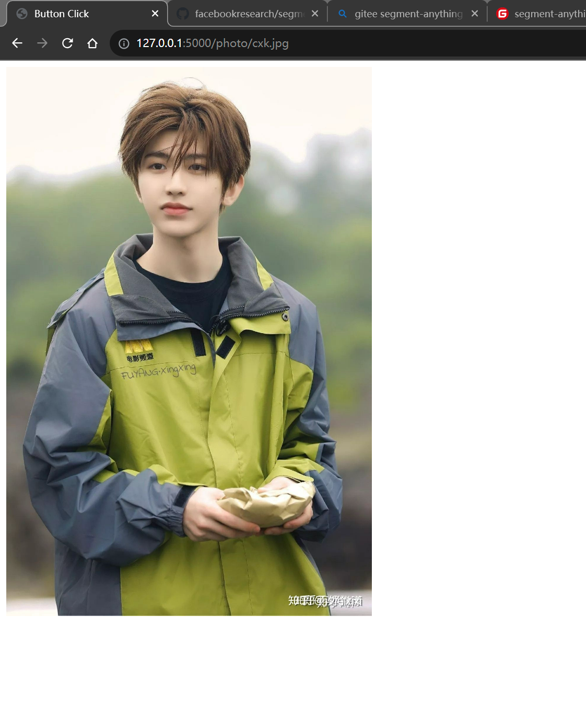
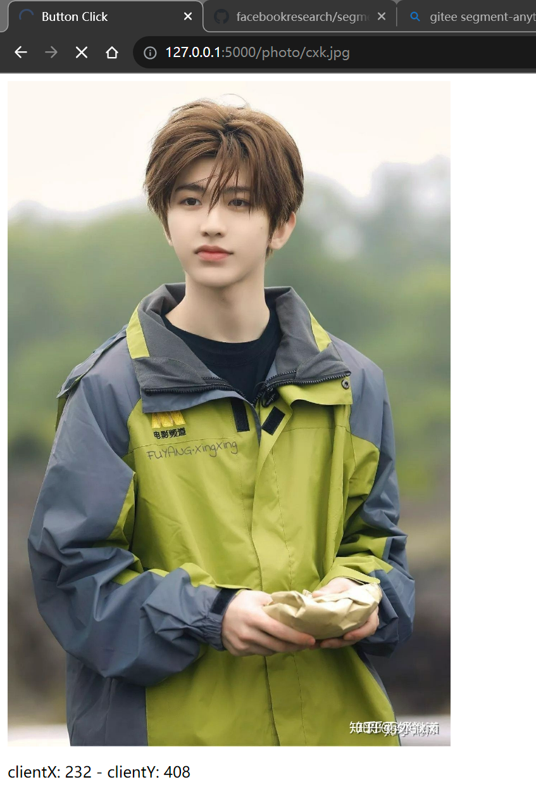
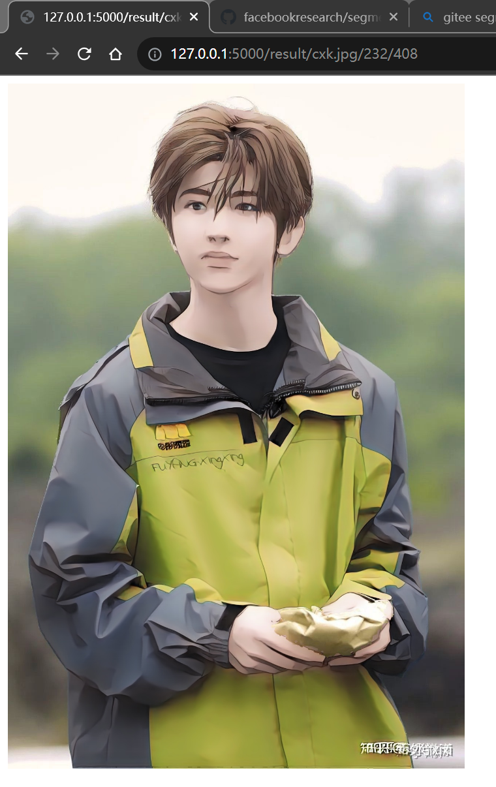
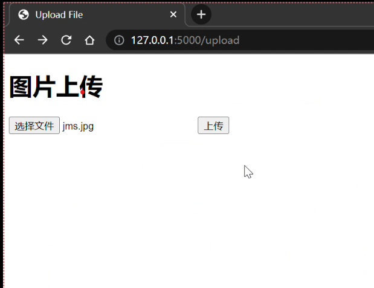
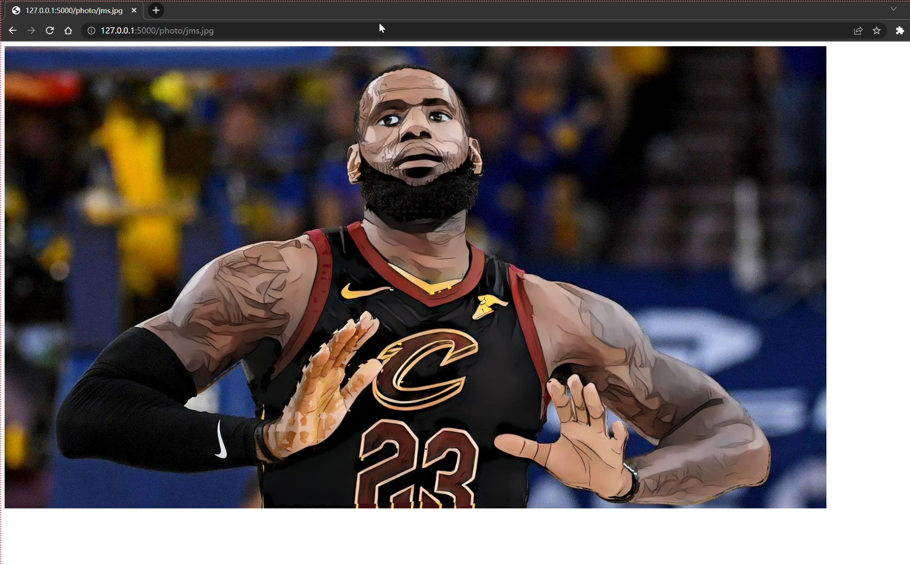

# 保留背景的图像风格迁移

## 8.8更新

### 新运行方法

1. 运行python文件方法与之前一样
  [跳转](#run_method)

2. 进入网站第一个界面是这个，选择需要风格迁移的图片，点击确定

    左边的几个按钮都没用

	
3. 点击确定之后进入第二个界面，在这里面选点，点一下之后会显示坐标。如果选择的点在图片范围之内，python的终端内会提示"选点成功"

	

4. 选点成功之后等待一到两分钟，会进入新的界面，在这个界面里面会显示原图和风格迁移之后的图片

	

### 关于代码

这次的代码**缝合**了前端和后端的代码，很多地方显得拧巴我也没办法。以后有机会再改进吧。

#### `test.py`
- 把upload换成了UL
- 把show换成了mouse
- 把showRes换成了showEffRes
	- 原代码里通过网页传入了鼠标点击的坐标x, y,现在有新加了图片左上角的坐标ex, ey。
		```py
		@app.route('/result/<name>/<x>/<y>/<ex>/<ey>')
		def showEffRes(name, x, y, ex, ey):
		```
	- 通过对鼠标点击的位置和网页图片的左上角位置进行计算，得出鼠标点击位置在图片上的相对位置。
		```py
		y = (y - ey) / 350 * height
		x = (x - ex) / 350 * height
		```
	- 将这个点传给`transfer_image`函数。

#### `UL.html`
这个基本上就是`new2.html`换了个名直接放上去了

值得注意的是，连接到css文件时
- css文件需要放在`flask-test/static/css文件夹下`
- 对应的文件地址也需要修改，代码应改为
```html
	<link rel="stylesheet" href="../static/css/styles.css">
```

#### `mouse.html`
新增了函数`getElementViewPosition(element)`，用于计算元素的左上角关于网页左上角的相对坐标，在`printMousePos`里面调用
```javascript
	var elemen = getElementViewPosition(document.getElementById("image-preview"));
	var ex = String(elemen.x);
	var ey = String(elemen.y);
```

#### `showEffRes`
这个页面写得十分丑陋，因为一些奇怪的原因，这个网页无法正常链接到css文件，现在依然没有解决这个问题。无奈之下只能把css文件里的内容放到了html文件的页首



我也不想有这两百多行的style......
## 可以用鼠标选则物体的网站

好了，现在代码又更新了（2023.8.7），要跑原来的代码请回退到之前的版本

如果你由于网络问题不能安装SAM，可以试试`pip install git+https://gitee.com/mirrors/segment-anything.git`国内镜像

### <div id="run_method">运行方法</div>

1. 进入flask-test文件夹
2. 运行`python test.py`



3. 点击终端中的网址，即可运行网页



4. 点击选择文件，选择一张图片，并点击上传



5. 用鼠标点击你要选择的物体，物体的任意部分均可（只用点击一下，这一步没有明显的提示反馈）

6. 等待**2分钟**左右，此时网页上会显示**加载**动画



7. 最终，网页会显示风格迁移后的结果



### 关于代码
其实我也有很多代码不太懂，我尽力写。有很多代码是测试时的遗迹，有的文件也没什么用。

#### `test_withsam`
这部分代码是关于AnimeGANv2 + SAM的，在之前的版本中已经运行成功了，我们只要假设它是一个封装好的包，只要传入cv2.imread()读入的图片，和提示点（鼠标选择点）的坐标，就可以将物体风格迁移后的图片存入`static/images/res.jpg`中

#### `test.py`
**html和python代码之间靠`render_template()`函数链接，具体细节也不太清楚**
- `upload()`为上传文件的网页
- `show()`为显示图片，并用鼠标选择物体的网页
  - 因为写了改，改了写，这个函数里有些东西是多余的，`render_template()`传入的参数也没有都用上
- `showRes()`为处理图片并最终显示结果的网页
  - `cv2.imread`将上传的图片读入`img`中
  - `height, width, _ = img.shape`读取图片的长宽
  - ```python
        @app.route('/result/<name>/<x>/<y>')
        def showRes(name, x, y):
    ```
    这两行代码代表该函数传入了x，y参数（鼠标点击坐标）。但是由于我不会传整数，x和y都是字符串类型的，通过`x = eval(x)`将x转换为整数（也可能是实数）
  - 下面的代码将鼠标点击坐标，**转换到图片坐标系**。我根据实验发现：图片的(0,0)点在网页是(8,8)点（可能有几个像素的误差）。因此将x,y减8。在网页中，我统一将图片的高度缩放到700，因此网页坐标与图片坐标的比例为$height / 700$。
  - 如果点击位置不在图片上，则跳转回`show`网页重新点击
  - 最后，调用`test_withsam.transfer_image(img, x, y)`将风格迁移

#### `/templates/show.html`
- `<script type="text/javascript">`: 这段代码的作用是，当鼠标点击时，读取鼠标坐标，并将网页跳转到显示结果的网页。那些注释都是失败的尝试呜呜呜
- `window.location`是用于用于跳转网页的代码
- 在跳转网页过程中，鼠标点击坐标这一参数要通过网址的形式传参，虽然我也觉得用网址传参很蠢，但是我也不会别的写法了。
- `"{{url_for('showRes', name=name, x='holdX', y='holdY')}}"`这是一个叫做`url_for`的函数，用于生成网址。由于在字符串中，所以函数外要加上双层大括号
- `.replace('holdX', x).replace('holdY', y)`不知为何，javascript中的变量不能直接作为参数传入`url_for`函数，需要先借用字符串常量'holdX'，'holdY'生成网址，再将x,y的值替换入网址中（x和y已经被转换为字符串）

#### `/templates/showRes.html`
我发现，图片必须放在static文件夹下，才能被显示出来。虽然这个代码很蠢，但是我也没办法改进了。
因此`test_withsam.transfer_image(img, x, y)`函数只能将图片保存在`static/images/res.jpg`中，最后由该网页显示
## AnimeGANv2 + SAM 运行方法

**由于本人把这个模型集成到网页里了，要运行AnimeGANv2 + SAM应该要回退到之前的代码版本**

1. 安装python、pytorch、numpy、opencv等环境
2. 按照教程安装SAM：https://github.com/facebookresearch/segment-anything
3. 克隆本仓库
4. 在[SAM](https://github.com/facebookresearch/segment-anything#model-checkpoints)，[AnimeGANv2](https://github.com/bryandlee/animegan2-pytorch/tree/main/weights)中，下载权重。SAM的权重放在`test_withsam.py`同级，AnimeGANv2的权重放在`\animegan2-pytorch\weights`文件夹中。当然，权重的路径可以在代码中修改
5. 在`test_withsam.py`中修改`IMAGE_PATH`变量为需要风格迁移的图片路径
6. 用终端在`animegan2-pytorch`中，运行`python test_withsam.py`，即可看到分割过程与最终结果。注意，关闭过程可视化图片后程序才会继续运行

### 运行效果


# flask使用方法

[有bug先看这里](https://blog.csdn.net/qq_39548074/article/details/104414158)
## hello world!
1. 进入flask-test文件夹
2. 运行`python test.py`
3. 将终端中的网址打开，即可看到网页"hello, world!"

## 显示静态图片
1. 静态图片必须放在static文件夹下
2. 运行`python test.py`
3. 在终端中网址后加上“/hello”即可进入显示图片的页面
## 进行简单的分割+迁移网页部署
1. 首先要能成功运行 **AnimeGANv2 + SAM**
2. 进入flask-test文件夹，在终端运行`python test.py`
3. 在终端中网址后加上“/upload”即可进入上传图片的页面
4. 选择图片并上传
5. 等待**两分钟**
6. 网页输出风格迁移图片
> 注意，sam的prompt还不能在网页中修改，需要到代码里修改提示点的位置才能分割不同位置的物体

网站效果


原图


网站生成图片
